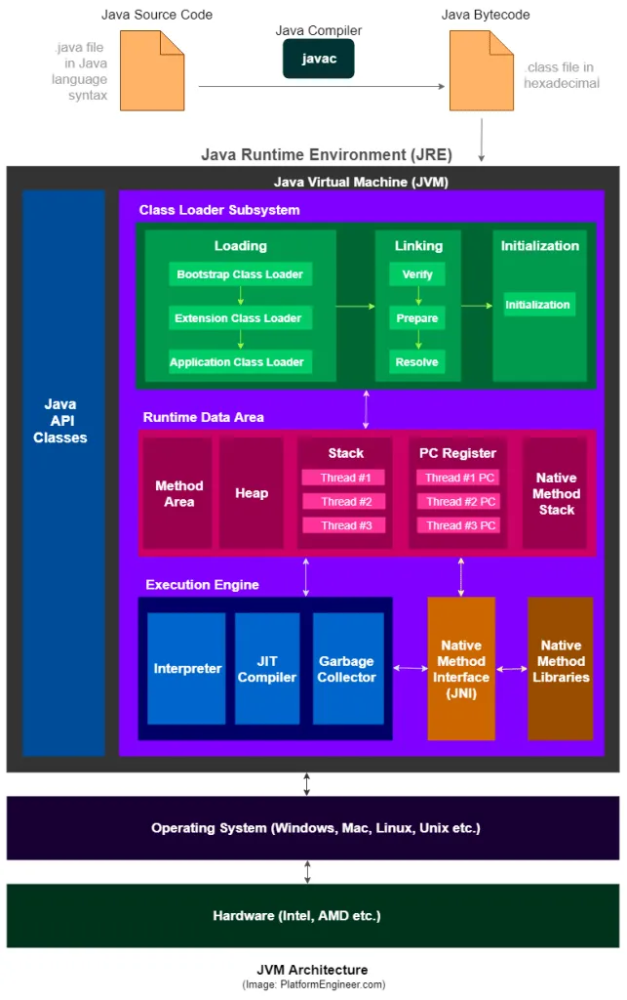

# Thread Stack

1. When a thread is started, JRE creates a new thread stack for it.
2. When the thread calls methodA(), the runtime environment pushes a new frame onto the thread stack. The frame contains
   the call stack and local variables, object references for methodA().
3. When methodB() is called from methodA(), again a new stack frame is pushed onto the thread stack. The frame contains
   the call stack and local variables for methodB().
4. When methodB() returns, the runtime environment pops the frame for methodB() off the thread stack. When methodA()
   returns, the runtime environment pops the frame for methodA() off the thread stack.
    

# Features of Stack memory:

* Stack memory grows and shrink dynamically.
* Faster to access as it follows LIFO principle.
* Variables declared in the stack exist only as long as the method that created them is running.
* It is inherently thread safe because each thread is executing in its own thread stack.
* It can throw StackOverflowError in case of recursive calls without base condition.
* Stack memory is automatically allocated when a method is called and automatically deallocated when the execution of
  the method is finished.

# Heap

Heap is a separate memory which contains all the objects created by java application no matter which thread created
them. 
When heap becomes insufficient, Java will throw OutOfMemoryError. This means that JVM has used all the available heap
size. 
Heap memory access is slower than stack memory because it involves dynamic memory allocation & deallocation managed by
GC. 
Heap memory is not inherently thread safe as multiple threads can access or modify the same objects.

> Primitive types for methods lives on stack memory and primitive types for objects live on heap memory.

Local Variables and Objects 
***Local Variables***
- Local variables in Java can be of primitive types or references to objects.
- Primitive-type local variables (e.g., `int`, `double`) are entirely stored on the thread stack and are not shared with other threads.
- If a local variable is a reference to an object, the reference itself is stored on the thread stack, but the actual object is stored on the heap.

***Objects and Their Member Variables***
- Objects, whether they are created as standalone instances or as member variables of other objects, are stored on the heap.
- An object’s member variables, whether they are of primitive types or references to other objects, are also stored on the heap.
- Even if an object’s methods contain local variables, these local variables are stored on the thread stack of the executing thread, not on the heap.

***Static Class Variables***
- Static class variables are also stored on the heap along with the class definition.
- These variables are shared among all instances of the class and all threads that access the class.

***Accessing Objects and Member Variables***
- Objects on the heap can be accessed by all threads that have references to them.
- When multiple threads call methods on the same object concurrently, they can access the object’s member variables.
- Each thread has its own copy of local variables when executing methods, even when working with the same code.

